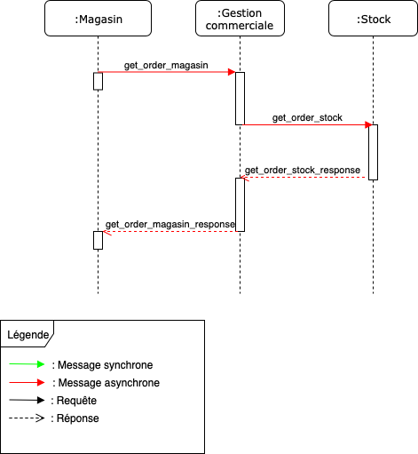

[Retour à l'index](index.md)

[Retour à la liste des use cases](userCases.md)

# Demande de réassort

Réaprovisionner le magasin

## Applications concernées
Magasin, Stocks

## API mises à disposition

### POST : bon de commande (magasin->gesco)

## API utilisées 

### POST : bon de commande (gesco->stock)
### POST : bon de livraison