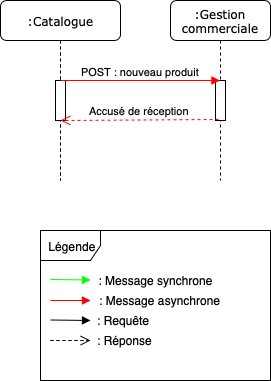

[Retour à l'index](index.md)

[Retour à la liste des uses cases](userCases.md)

# Réaprovisionner stock

Ajouter des stocks quand un nouveau produit est ajouté au catalogue

## Applications concernées
Catalogue

## API mises à disposition

### POST : nouveau produit

## API utilisées

Aucune